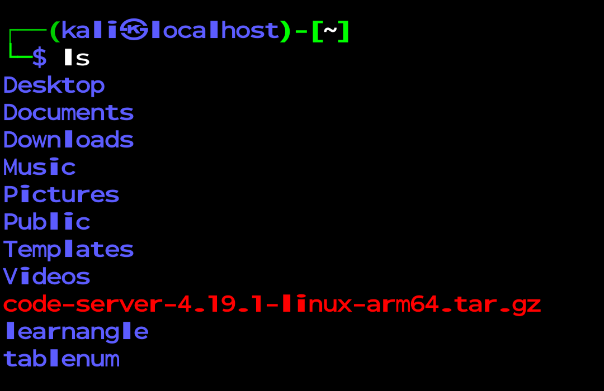

# How to install code server in kali nethunter rootless

### Step 1: 
[Download](https://github.com/coder/code-server/releases/download/v4.19.1/code-server-4.19.1-linux-arm64.tar.gz) the latest code server

### Step 2:
Go to your phone storage's download folder and cut cod-server file and paste it in kali (In my case I paste file in kali-arm64/home/kali)
<br><br>


> Use [files app](https://play.google.com/store/apps/details?id=com.marc.files) to move file from phone storage to kali.

### Step 3:
Extract the file 
```linux
tar -xvf code-server-4.19.1-linux-arm64.tar.gz
```

### Step 4: 
Change password for code server
```
nano ~/.config/code-server/config.yaml
```

### Step 5: 
Go to bin folder
```
cd code-server-4.19.1-linux-arm64/bin
```

### Step 6:
Run code server
```
./code-server
```
### Step 7:
Enter this url in Chrome
[](http://localhost:8080/) and type password to connect 
