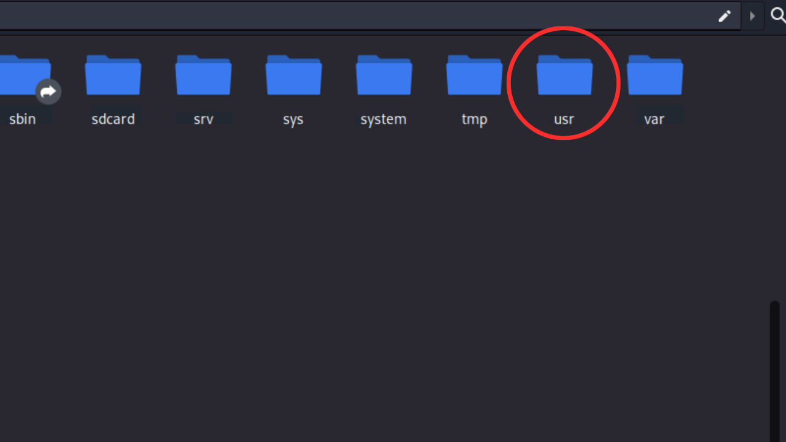
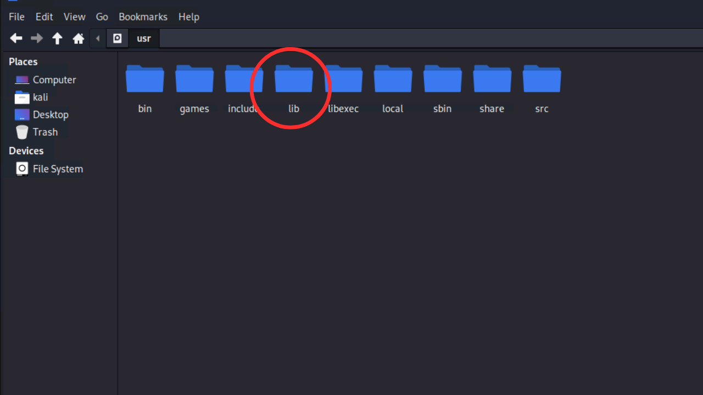
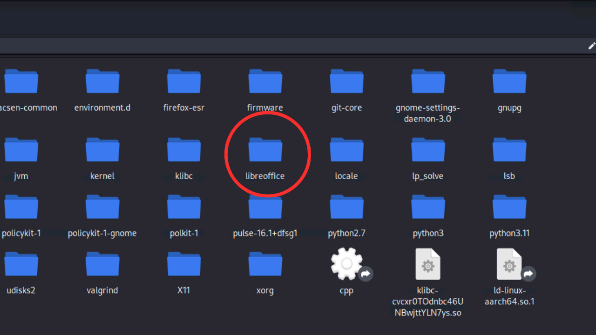

# Step by Step process for Fixing Proc Error Of libreoffice in termux

### Step 1: Download hex editor
Download any hex editor (for example: ghex) in kali.
```termux
sudo apt install ghex
```
### Step 2:
Connect termux with nethunter & open<br> `file system`

### Step 3: 
Open `usr` folder
<br><br>


### Step 4: 
Open `lib` folder
<br><br>


### Step 5: 
Open `libreoffice` folder
<br><br>



