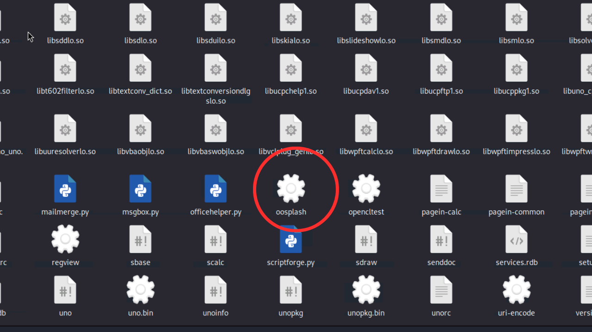

# Step by step process for fixing proc error Of libreoffice in termux

### Step 1: Download hex editor
Download any hex editor (for example: ghex) in kali.
```termux
sudo apt install ghex
```
### Step 2:
Connect termux with nethunter & open<br> `file system`

### Step 3: 
Open `usr` folder
<br><br>


### Step 4: 
Open `lib` folder
<br><br>


### Step 5: 
Open `libreoffice` folder
<br><br>


### Step 5: 
Open `program` folder
<br><br>


### Step 6: 
Here you will find `oosplash` file
<br><br>


### Step 7:
open `oosplash` file with ghex editor
<br><br>


### Step 8: 
Open 'Find and replace` menu
<br><br>


### Step 9: 
Find `proc` and replace with `prod`
<br><br>


### Step 10:
Save changes
<br><br>


### Step 11: 
Again open `File System` and create a `prod` folder
<br><br>


### Step 12: 
Inside prod folder create a `version` folder
<br><br>


## Step 13: 
Now open libreoffice and enjoy
<br><br>


<hr>

Need any help?
Contact me on <a href="mailto:himanshukushwaha548@gmail.com">himanshukushwaha548@gmail.com</a>


